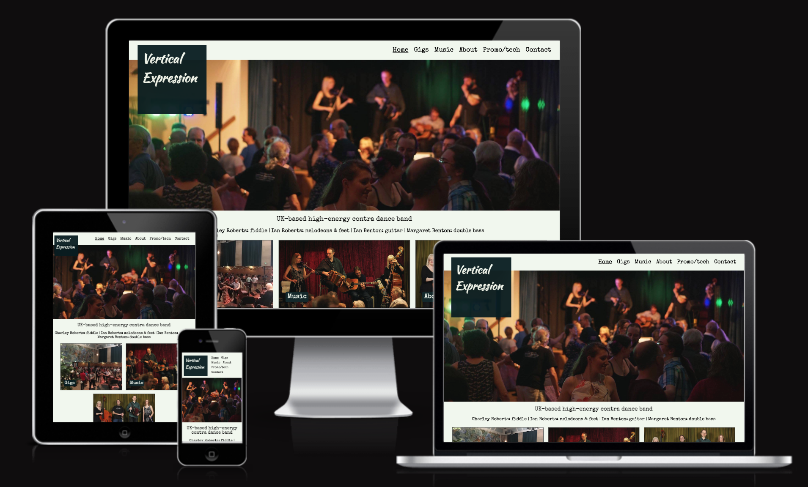

# Vertical Expression

Vertical Expression are a UK-based contra dance (folk dance) band who perform at folk festivals and other dance events around the country. 

Their existing website hasn't been updated for several years so they need a new one which looks more modern, incorporates best practice in UI/UX design, is built using responsive design to display properly on phones and tablets and meets today's accessibility standards.

The website promotes the band to audience members and event organisers, and informs their existing fans about where they will be performing next.



---

## Users of this website and their goals

Fans of the band: 
- To find out where they are next performing and access details of the events

Potential event attendees who haven't heard the band before: 
- To hear what the band's music sounds like

Event organisers who are considering booking the band: 
- To hear the band's music, find out which other events they have previously performed at, and find their contact details

Event organisers Who have already booked the band:
- To access information needed for their event (biog, hi res photo and tech spec)

---

## Existing features

### Across all pages

Header, footer, banner image and navbar features are consistent in location and visual design across the whole site for ease of navigation and to ensure the user feels that all pages are part of the same site, with some adjustments to sizes to accommodate responsive design.

- Header styled into a square background - present on every page so the user knows whose website they're looking at whichever page they first arrive on.

- Navbar in the top right of the pgae, with the most frequently used pages as the leftmost items, and the contact page in the furthest right position, as per convention. Navbar items have underline to show the current page and change of colour on hover to indicate that they are clickable links.

- Footer to denote the end of the page, which contains a link to the band's Facebook page.

- The 'hero' image on the homepage is used as a header image across all pages. A cropped version (i.e. shorter height) is used on the non-homepage pages and a shorter-width version is used for tablet and mobile screens to ensure it displays well on each page.

### Homepage

- Eyecatching hero image which aims to quickly convey to the user a sense of energy and movement and a positive feeling about the band.

- Tagline summarising the band in a few words, and list of band members and instruments, to explain within a few seconds who the band are and what they do.

- Links to the three most frequently visited pages, with images to add more visual interest to the homepage and visually convey more information about the band. Images fade on hover to give feedback to the user that they are clickable links.

### Gigs page

- A simple list of upcoming and past events, with links to the websites of upcoming events so users can find the details they need in order to attend.

### Music page

Users can listen to the band's music, either as audio clips or video clips with audio, depending if they want visual content or not alongside the music.

- Audio clips presented using the browsers own audio player, with stop/play/mute/volume controls and without autoplay.

- Video clips embedded from the band's Facebook page (using embed code provided by Facebook). Includes stop/play/mute/volume controls and fullscreen option, and videos do not play automatically on loading the page.

### About page

- Primarily text content in order to describe the band and the type of dancing they play for in more detail.

- Also includes one video embedded from YouTube to illustrate the textual description of contra dancing. Includes play/stop/mute/volume controls, fullscreen option and does not play automatically on loading the page.

- The horizontal image partway down the page (provided mainly for decoration) uses the <picture> element in order to enable responsive design.  The browser has a choice of three image files available so it can select the one most suitable for that browser. The image files are a wider image containing three photos intended for desktop and laptop (and landscape view on tablet) screens, a narrower one containing two photos intended for portrait tablet screens, and a single photo for phone screens.  The three-photo image is also provided as an  in case the browser does not recognise the <picture> element.

### Promo & tech info page

- This page is for event organisers who have booked the band to obtain information they need for their event.  Each piece of information (biography, publicity photo and tech spec) is provided as a download so organisers can easily save it to their computer for later use, and also displayed on screen so they are not obliged to download it first in order to view its contents.

### Contact page

-

## Features not included in this release

---

## UI design

### Visual design

### Responsive design

### Accessibility considerations

---
## Testing

### Checkers

No problems found on the w3checker for HTML

No problems found on the jigsaw checker for CSS

100% acessibility score on Lighthouse (in browser Devtools)

### Bugs


---
## Deployment

(Description of the process goes here)

('Technologies used?')

---
## Credits

- Text was written by myself
- Audio clips and the 'lockdown' music video were recorded by the band
- Photos and videos of the band were taken for us by friends and I have permission to use them 
- The video in the 'what's contra' section was recorded by me
- Icons are from Fontawesome
- Fonts are from Google Fonts

### Reference documents used: 
- CodeInstitute HTML and CSS course material
- CodeInstitute 'LoveRunning' walkthrough project guidance 
- Mozilla Developer Network documentation on HTML and CSS

---


Welcome Charley Roberts,

This is the Code Institute student template for Gitpod. We have preinstalled all of the tools you need to get started. It's perfectly ok to use this template as the basis for your project submissions.

You can safely delete this README.md file, or change it for your own project. Please do read it at least once, though! It contains some important information about Gitpod and the extensions we use. Some of this information has been updated since the video content was created. The last update to this file was: **September 1, 2021**

## Gitpod Reminders

To run a frontend (HTML, CSS, Javascript only) application in Gitpod, in the terminal, type:

`python3 -m http.server`

A blue button should appear to click: _Make Public_,

Another blue button should appear to click: _Open Browser_.

To run a backend Python file, type `python3 app.py`, if your Python file is named `app.py` of course.

A blue button should appear to click: _Make Public_,

Another blue button should appear to click: _Open Browser_.

In Gitpod you have superuser security privileges by default. Therefore you do not need to use the `sudo` (superuser do) command in the bash terminal in any of the lessons.

To log into the Heroku toolbelt CLI:

1. Log in to your Heroku account and go to *Account Settings* in the menu under your avatar.
2. Scroll down to the *API Key* and click *Reveal*
3. Copy the key
4. In Gitpod, from the terminal, run `heroku_config`
5. Paste in your API key when asked

You can now use the `heroku` CLI program - try running `heroku apps` to confirm it works. This API key is unique and private to you so do not share it. If you accidentally make it public then you can create a new one with _Regenerate API Key_.

------

## Release History

We continually tweak and adjust this template to help give you the best experience. Here is the version history:

**September 1 2021:** Remove `PGHOSTADDR` environment variable.

**July 19 2021:** Remove `font_fix` script now that the terminal font issue is fixed.

**July 2 2021:** Remove extensions that are not available in Open VSX.

**June 30 2021:** Combined the P4 and P5 templates into one file, added the uptime script. See the FAQ at the end of this file.

**June 10 2021:** Added: `font_fix` script and alias to fix the Terminal font issue

**May 10 2021:** Added `heroku_config` script to allow Heroku API key to be stored as an environment variable.

**April 7 2021:** Upgraded the template for VS Code instead of Theia.

**October 21 2020:** Versions of the HTMLHint, Prettier, Bootstrap4 CDN and Auto Close extensions updated. The Python extension needs to stay the same version for now.

**October 08 2020:** Additional large Gitpod files (`core.mongo*` and `core.python*`) are now hidden in the Explorer, and have been added to the `.gitignore` by default.

**September 22 2020:** Gitpod occasionally creates large `core.Microsoft` files. These are now hidden in the Explorer. A `.gitignore` file has been created to make sure these files will not be committed, along with other common files.

**April 16 2020:** The template now automatically installs MySQL instead of relying on the Gitpod MySQL image. The message about a Python linter not being installed has been dealt with, and the set-up files are now hidden in the Gitpod file explorer.

**April 13 2020:** Added the _Prettier_ code beautifier extension instead of the code formatter built-in to Gitpod.

**February 2020:** The initialisation files now _do not_ auto-delete. They will remain in your project. You can safely ignore them. They just make sure that your workspace is configured correctly each time you open it. It will also prevent the Gitpod configuration popup from appearing.

**December 2019:** Added Eventyret's Bootstrap 4 extension. Type `!bscdn` in a HTML file to add the Bootstrap boilerplate. Check out the <a href="https://github.com/Eventyret/vscode-bcdn" target="_blank">README.md file at the official repo</a> for more options.

------

## FAQ about the uptime script

**Why have you added this script?**

It will help us to calculate how many running workspaces there are at any one time, which greatly helps us with cost and capacity planning. It will help us decide on the future direction of our cloud-based IDE strategy.

**How will this affect me?**

For everyday usage of Gitpod, it doesn’t have any effect at all. The script only captures the following data:

- An ID that is randomly generated each time the workspace is started.
- The current date and time
- The workspace status of “started” or “running”, which is sent every 5 minutes.

It is not possible for us or anyone else to trace the random ID back to an individual, and no personal data is being captured. It will not slow down the workspace or affect your work.

**So….?**

We want to tell you this so that we are being completely transparent about the data we collect and what we do with it.

**Can I opt out?**

Yes, you can. Since no personally identifiable information is being captured, we'd appreciate it if you let the script run; however if you are unhappy with the idea, simply run the following commands from the terminal window after creating the workspace, and this will remove the uptime script:

```
pkill uptime.sh
rm .vscode/uptime.sh
```

**Anything more?**

Yes! We'd strongly encourage you to look at the source code of the `uptime.sh` file so that you know what it's doing. As future software developers, it will be great practice to see how these shell scripts work.

---

Happy coding!


