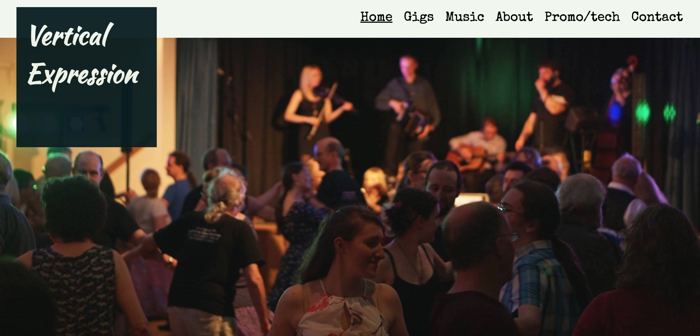
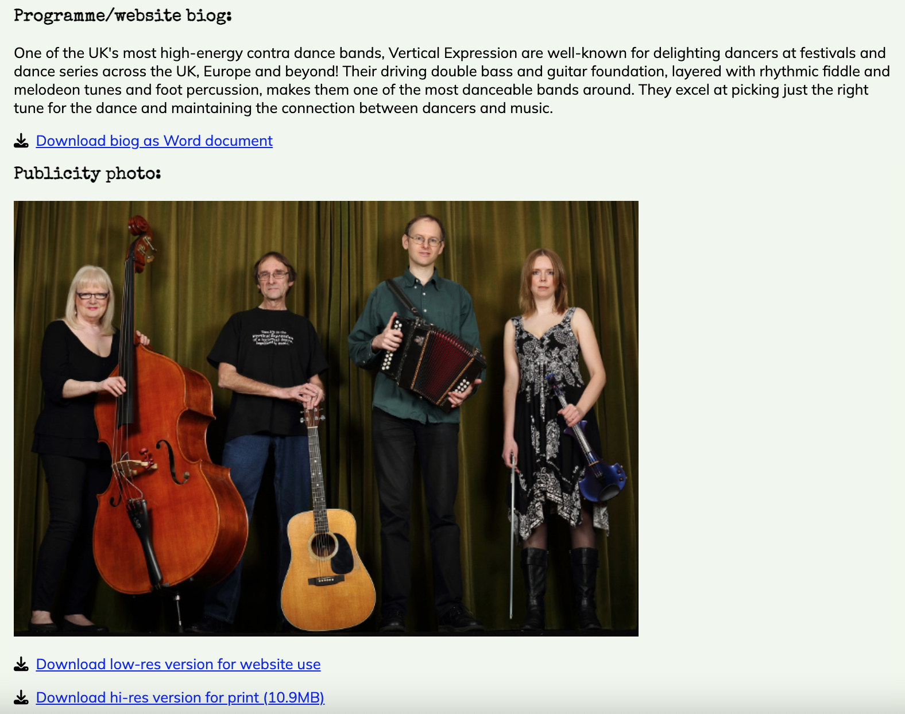
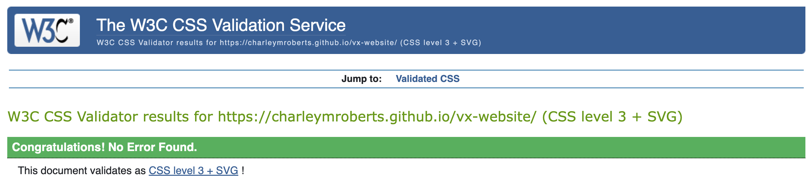
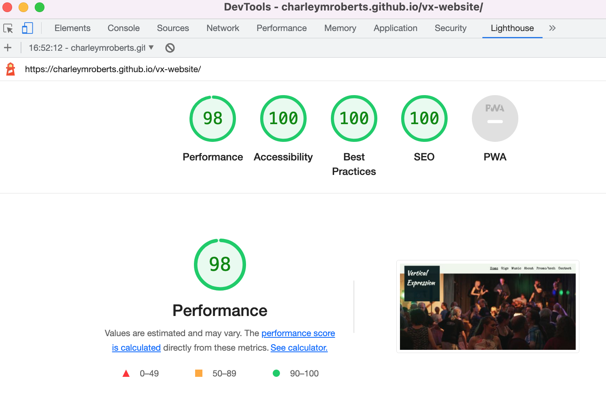

# Vertical Expression

Vertical Expression are a UK-based contra dance (folk dance) band who perform at folk festivals and other dance events around the country. 

## Key project goals & target audience

The band's existing website hasn't been updated for several years so they need a new one which looks modern, incorporates best practice in UI/UX design to provide a positive experience for the user, is built using responsive design to display properly on phones and tablets and meets today's accessibility standards.

The website promotes the band and their music to audience members and event organisers, informs their fans about where they will be performing next, and provides contact details for the band.

The website is live at [https://charleymroberts.github.io/vx-website/](https://charleymroberts.github.io/vx-website/)

---

## Users of this website and their goals

Fans of the band: 
- To find out where the band are next performing and access details of the events

Potential event attendees who haven't heard the band before: 
- To hear what the band's music sounds like

Event organisers who are considering booking the band: 
- To hear the band's music, find out which other events they have previously performed at, and find their contact details

Event organisers who have already booked the band:
- To access information needed for their event (biog, hi res photo and tech spec)

---

## Existing features

### Across all pages

Header, footer, banner image and navbar features are consistent in location and visual design across the whole site for ease of navigation and to ensure the user feels that all pages are part of the same site, with some adjustments to sizes to accommodate responsive design.

- Header styled into a square background - present on every page so the user knows whose website they're looking at whichever page they first arrive on.

- Navbar in the top right of the page, with the most frequently used pages as the leftmost items, and the contact page in the furthest right position, as per convention. Navbar items display an underline to show the current page and change colour on hover to indicate that they are clickable links.

- Footer to denote the end of the page, which contains a link to the band's Facebook page.

- The 'hero' image on the homepage is used as a header image across all pages. A cropped version (i.e. shorter height) is used on the non-homepage pages and a shorter-width version is used for tablet and mobile screens to ensure it displays well on each page.

### Homepage

- Eyecatching hero image which aims to quickly convey to the user a sense of energy and movement and a positive feeling about the band.

- Tagline summarising the band in a few words, and list of band members and instruments, to explain within a few seconds who the band are and what they do.

- Links to the three most frequently visited pages, with images to add more visual interest to the homepage. Images fade on hover to give feedback to the user that they are clickable links.

### Gigs page

- A simple list of upcoming and past events, with links to the websites of upcoming events so users can find the details they need in order to attend.

### Music page

Users can listen to the band's music, either as audio clips or video clips with audio, depending if they want visual content or not alongside the music.

- Audio clips presented using the browsers own audio player, with stop/play/mute/volume controls and without autoplay.

- Video clips embedded from the band's Facebook page (using embed code provided by Facebook). Includes stop/play/mute/volume controls and fullscreen option, and videos do not play automatically on loading the page.

### About page

- Primarily text content describing the band and the type of dancing they play for in more detail.

- Also includes one video embedded from YouTube to illustrate the textual description of contra dancing. Includes play/stop/mute/volume controls, fullscreen option and does not play automatically on loading the page.

- The horizontal image partway down the page (provided mainly for decoration) uses the `<picture>` element in order to enable responsive design.  The browser has a choice of three image files available so it can select the one most suitable for that browser. The image files are a wider image containing three photos intended for desktop and laptop (and landscape view on tablet) screens, a narrower one containing two photos intended for portrait tablet screens, and a single photo for phone screens.  The three-photo image is also provided as an `` in case the browser does not recognise the `<picture>` element.

### Promo & tech info page

- This page is for event organisers who have booked the band to obtain information they need for their event.  Each piece of information (biography, publicity photo and tech spec) is provided as a download so organisers can easily save it to their computer for later use, and also displayed on screen so they are not obliged to download it first in order to view its contents.

### Contact page

- Simple contact details page providing an email address, link to the band's Facebook page and a HTML contact form.

- Note that the contact form is not functional: for the purposes of this project I have included it to show how I would use HTML and CSS to create the front end. I have used a GET request to display a 'thank you' page (instead of a POST request to send the form data to a server which would be used in a fully functional version of this website).

## Features not included in this release

### Hamburger menu on phone screens

- A hamburger menu instead of the existing navbar would make the website look tidier on phone screens. However, as I have not yet learned how to implement one and as the existing navbar is perfectly useable as it is and displays adequately, I have decided not to try and include this feature.

### List of previous gigs with a `
` element

- On a future version of the website I could include the band's full list of previous gigs, using a `
` element to display each year's gigs in a collapsible menu with one element for each year (with the year as the `
` element).

---

## UI design

### Visual design

- **Colours**

    - The **colour scheme** mainly uses #081d21 (a dark green/black) for the header and footer and #f1f7ed (mint cream) for the background of the body, with black body text on the mint cream background, or mint cream text on the dark green background. Colours were chosen to provide sufficient contrast between text and background elements and to complement the colours of the header image.  I used the website [coolors.co](https://coolors.co) to help me choose colours which go together.

- **Fonts**

    - The **fonts** were chosen to add visual interest and are intended to convey a modern but slightly informal feel, while also being uncomplicated enough to be fairly easy to read. I used two main fonts, Special Elite for headings and Mulish for the body text, with alternative backup fonts of Arial and sans-serif specified in the `font-family`. Additionally I used Kaushan Script solely for the `<h1>` text in the main page header.  These fonts were taken from [Google Fonts](https://fonts.google.com) and are displayed using a script copied from Google Fonts into the css file of the website.

- **Background**

    - The **background** is kept deliberately plain so as not to distract from the images and text. The images themselves are quite colourful and busy, and there is quite a lot of text content on some of the pages, so a more detailed background could feel overwhelming to the user.

- **Overall design**

    - The **overall design** is fairly neutral, as the website will potentially be accessed by a variety of users, so it does not want to be strongly targeted at any one demographic or age group.

- **Layout**

    - I initially created wireframes using [Balsamiq](https://balsamiq.com/) to help me design the **layout** of the site. The main components of the layout are kept the same across all pages to give the user an intuitive experience as they navigate around the site.

### Accessibility considerations

- The text overlaid on the clickable images on the homepage has a dark background added, to provide more contrast with the text than the photos on their own would provide.

- The header has an `aria-label` to inform the user that it is a link back to the homepage if clicked, and the Facebook logo in the footer contains an aria-label to tell the user that it is a link to the band's Facebook page and that it opens in a new tab. These are the only elements which are not already described in ways accessible to screen readers.

- I did not add `aria-label`s to the background images used in the header or on the homepage (or format them as images with `alt` text), as these are present for decoration and do not add to the information content of the page. The only photo which could arguably convey informative content is the close-up of the band (in the link to the 'about' page), but there is already text on the homepage immediately above it conveying the same information (i.e that there are four band members and the instruments they play).

### Responsive design

- The CSS uses two `@media` queries to adjust how the website is displayed at a screen `max-width` of 900px (for tablets) and of 500px (for phones). The 500px settings also work for smaller phones of 320px.  I used various devices in my house (desktop screen, laptop screen, iPad and two sizes of iPhone) and the tool in Google Chrome DevTools which renders the website on different sizes of screen to check that the website displays correctly at a range of different sizes.

- Most elements of the site are sized in rems, so that they will automatically resize themselves to suit the size of the screen they are being viewed on.  I found I needed to resize a few elements to make them display sensibly with the screen widths specified in the `@media` queries for tablet and phone screens: the square background to the `<h1>` (as it overlapped the header photo too much otherwise), the navbar `<li>` items, the header images (I used a couple of different versions of the same image that were cropped in different ways) and the videos embedded from Facebook using iframes on the 'Music' page.

---
## Testing

### Checkers

No problems found by the Nu Html checker [https://validator.w3.org/](https://validator.w3.org/)

 
No problems found on the Jigsaw W3C CSS checker [https://jigsaw.w3.org/css-validator/](https://jigsaw.w3.org/css-validator/)

100% acessibility score on Lighthouse (in browser DevTools) for desktop and mobile versions of the site.

All internal links and hyperlinks have been checked and found to be working correctly.

### Bugs

One thing I had difficulty with was making iframes display properly on smaller screen sizes.  They did not appear to respond to any attempts to automatically resize them (such as sizing in rems or implementing a `max-width` of 100%), it seemed they needed to be given fixed heights and widths in pixels.  At one point the overflow content from one of the iframes made the footer appear partway up the page when viewed on phone screens.  I worked around this by selecting a manual size for the iframe that fitted onto all phone screens tested, including smaller ones, although it would display as a slightly different proportion of different sized phone screens.  In practice most phone users would be likely to view the videos using full-screen anyway.

---
## Deployment

I deployed the site using GitHub Pages.  The steps were:

- On the GitHub page for this project, go to the 'Settings' menu
- Go to 'Pages'
- Under 'Build and deployment > Branch', select 'main'
- Click 'Save'

---
## Credits

- Text was written by myself
- Audio clips and the 'lockdown' music video were recorded by the band
- Photos and videos of the band were taken for us by friends and I have permission to use them 
- The video in the 'what's contra' section was recorded by me
- Icons are from [Fontawesome](https://fontawesome.com)
- Fonts are from [Google Fonts](https://fonts.google.com)

### Reference documents used: 
- CodeInstitute HTML and CSS course material
- CodeInstitute 'LoveRunning' walkthrough project guidance 
- [Mozilla Developer Network](https://developer.mozilla.org/en-US/) documentation on HTML and CSS